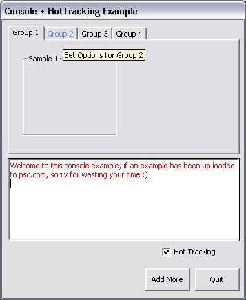



## Console \+ HotTracking Example

### Description

This example will show you how to make tabstrips use the "HotTracking" mode, and how to use a console richtextbox wise, eg: insert text with colour.
 
### More Info
 

             |
---                |---
**Submitted On**   |2002-06-25 17:02:12
**By**             |[Tony\.](https://github.com/Planet-Source-Code/PSCIndex/blob/master/ByAuthor/tony.md)
**Level**          |Beginner
**User Rating**    |4.8 (19 globes from 4 users)
**Compatibility**  |VB 6\.0
**Category**       |[Miscellaneous](https://github.com/Planet-Source-Code/PSCIndex/blob/master/ByCategory/miscellaneous__1-1.md)
**World**          |[Visual Basic](https://github.com/Planet-Source-Code/PSCIndex/blob/master/ByWorld/visual-basic.md)
**Archive File**   |[Console\_\+\_983996252002\.zip](https://github.com/Planet-Source-Code/tony-console-hottracking-example__1-36237/archive/master.zip)

